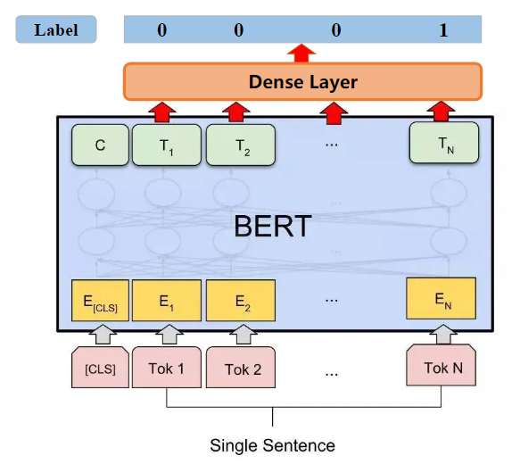

# ElectraForSpellingCheck: 基于 Electra 预训练模型的中文拼写检查

ElectraForSpellingCheck 是一个使用序列标注模型实现中文拼写检查的训练方法，提供样本集构造、数据预处理、模型构建、高效训练与评估等模块。

## 1. 依赖环境

- Python 3.10.6

- torch 1.13.0

- accelerate 0.17.0

- easytokenizer 0.2.0

- transformers 4.25.1

- torchmetrics 0.11.1

easytokenizer 是基于 C++ 实现的高性能 Tokenizer 库，可通过如下命令安装：

```shell
pip install git+https://github.com/zejunwang1/easytokenizer.git
```

## 2. 样本集构造

为了在模型训练阶段能学习到更广范围的错别字知识，本项目提出了一种混合的 MASK 策略：基于 Electra Generator 和同音形近混淆集对中文句子进行 MASK。经过统计发现，文本中超过 70% 的错误是由于同音近音字引起的，因此在 mask 时可以让拼音混淆集有更大概率被选中。

具体地，对训练语料中一定比例（e.g. 5%）的 tokens 进行 mask，针对随机选中的一个汉字 token，替换策略如下：

- 20% 的概率基于 Electra Generator 生成替换字；

- 30% 的概率随机用一个同音字；

- 15% 的概率随机用一个近音字；

- 15% 的概率随机用一个形近字；

- 10% 的概率用词汇表中的任意一个字；

- 10% 的概率保持不变。

preprocess.py 实现了上述替换策略：

```
usage: preprocess.py [-h] --sentence_file SENTENCE_FILE --common_characters_file COMMON_CHARACTERS_FILE --homophone_file HOMOPHONE_FILE
                     --near_phonetic_file NEAR_PHONETIC_FILE --similar_file_1 SIMILAR_FILE_1 --similar_file_2 SIMILAR_FILE_2 --vocab_file
                     VOCAB_FILE [--mask_ratio MASK_RATIO] [--seed SEED] [--generator GENERATOR] [--topk TOPK] [--do_lower_case]

Chinese spelling check preprocess.

options:
  -h, --help            show this help message and exit
  --sentence_file SENTENCE_FILE
                        The full path of sentences to be processed.
  --common_characters_file COMMON_CHARACTERS_FILE
                        The full path of 3500 Chinese characters.
  --homophone_file HOMOPHONE_FILE
                        The full path of homophone set.
  --near_phonetic_file NEAR_PHONETIC_FILE
                        The full path of near-phonetic character set.
  --similar_file_1 SIMILAR_FILE_1
                        The full path of similar character set from PLOME.
  --similar_file_2 SIMILAR_FILE_2
                        The full path of similar character set from other sources.
  --vocab_file VOCAB_FILE
                        The vocabulary file to be used.
  --mask_ratio MASK_RATIO
                        The ratio of characters to be replaced. Default 0.05
  --seed SEED           Random seed. Default 42
  --generator GENERATOR
                        The chinese electra generator to be used. Default hfl/chinese-electra-180g-base-generator
  --topk TOPK           The number of candidate characters. Default 30
  --do_lower_case       Set this flag if you are using an uncased model.
```

原始语料的输入格式为每行一个中文句子， 示例（data/sentences.txt）如下：

```
《规划》指出，建设数字中国是数字时代推进中国式现代化的重要引擎，是构筑国家竞争新优势的有力支撑。
加快数字中国建设，对全面建设社会主义现代化国家、全面推进中华民族伟大复兴具有重要意义和深远影响。
办好数字中国建设峰会等重大活动，举办数字领域高规格国内国际系列赛事，推动数字化理念深入人心，营造全社会共同关注、积极参与数字中国建设的良好氛围。
```

```shell
python preprocess.py --sentence_file data/sentences.txt --common_characters_file confusions/common_3500.txt --homophone_file confusions/same_pinyin.txt --near_phonetic_file confusions/simi_pinyin.txt --similar_file_1 confusions/same_stroke.txt --similar_file_2 confusions/similar_chars.txt --vocab_file data/vocab.txt --seed 42 --generator hfl/chinese-electra-180g-base-generator --topk 30 --do_lower_case --mask_ratio 0.05
```

生成的训练样本集示例（data/train.txt）如下：

```
《规划》指出，建设数字中国是数字时段推进中国式现代化的重要引擎，是构筑国家竞争新潮势的有力支撑。	40	潮	17	段
加快数字中国迁设，对全面建设社会主义现代化国家、全面推进中华民族伟大复兴具有重要意义和深远影响。	6	迁
办好数句中国建设峰会等众大活动，举办数字领域高规格国内国际系列赛事，推动数字化理念深入人心，营造全社会共同关注、积极参与数字中国谴设的良好氛围。    11	众	3	句	64	谴
```

可使用 preprocess.py 基于自己的语料库构造训练样本集。

## 3. 模型训练

模型结构为 ELECTRA + Linear Classifier，如下图所示：



损失函数支持以下三种类型：

- 二分类交叉熵 Binary Cross Entropy

- 标签平滑正则化的二分类交叉熵 Label Smoothed Cross Entropy

- 聚焦于难分样本的焦点损失函数 Focal Loss

train.py 实现了序列标注模型的训练与评估：

```
usage: train.py [-h] --train_file TRAIN_FILE --eval_file EVAL_FILE --vocab_file VOCAB_FILE [--seed SEED] [--output_dir OUTPUT_DIR]
                [--pretrained_model_name_or_path PRETRAINED_MODEL_NAME_OR_PATH] [--do_lower_case] [--cpu] [--mixed_precision {no,fp16,bf16}]
                [--train_batch_size TRAIN_BATCH_SIZE] [--eval_batch_size EVAL_BATCH_SIZE] [--max_seq_length MAX_SEQ_LENGTH]
                [--max_steps MAX_STEPS] [--epochs EPOCHS] [--learning_rate LEARNING_RATE] [--weight_decay WEIGHT_DECAY]
                [--warmup_proportion WARMUP_PROPORTION] [--warmup_steps WARMUP_STEPS] [--max_grad_norm MAX_GRAD_NORM]
                [--magnification MAGNIFICATION] [--gradient_accumulation_steps GRADIENT_ACCUMULATION_STEPS] [--loss_type {lsr,bce,focal}]
                [--reduction {mean,sum}] [--alpha ALPHA] [--gamma GAMMA] [--label_smoothing LABEL_SMOOTHING] [--pos_weight POS_WEIGHT]
                [--save_best_model] [--logging_steps LOGGING_STEPS] [--save_steps SAVE_STEPS]

Sequence labeling model for spelling error check.

options:
  -h, --help            show this help message and exit
  --train_file TRAIN_FILE
                        The full path of training set.
  --eval_file EVAL_FILE
                        The full path of evaluation set.
  --vocab_file VOCAB_FILE
                        The full path of vocabulary file.
  --seed SEED           Random seed for initialization. Default 42
  --output_dir OUTPUT_DIR
                        Optional directory where model checkpoint will be stored. Default checkpoint/
  --pretrained_model_name_or_path PRETRAINED_MODEL_NAME_OR_PATH
                        The pretrained base model to be used. Default hfl/chinese-electra-180g-base-discriminator
  --do_lower_case       Set this flag if you are using an uncased model.
  --cpu                 If passed, will train on the CPU.
  --mixed_precision {no,fp16,bf16}
                        Whether to use mixed precision. Choose between fp16 and bf16 (bfloat16). Bf16 requires PyTorch >= 1.10 and an Nvidia
                        Ampere GPU. Default None
  --train_batch_size TRAIN_BATCH_SIZE
                        Batch size per GPU/CPU for training. Default 64
  --eval_batch_size EVAL_BATCH_SIZE
                        Batch size per GPU/CPU for evaluation. Default 64
  --max_seq_length MAX_SEQ_LENGTH
                        The maximum total input sequence length after tokenization. Sequences longer than this will be truncated. Default 192
  --max_steps MAX_STEPS
                        Set total number of training steps to perform. If > 0: Override num_train_epochs. Default -1
  --epochs EPOCHS       Total number of training epochs to perform. Default 3
  --learning_rate LEARNING_RATE
                        The initial learning rate for Adam. Default 5e-5
  --weight_decay WEIGHT_DECAY
                        Weight decay if we apply some. Default 0.01
  --warmup_proportion WARMUP_PROPORTION
                        Linear warmup proportion over the training process. Default 0.1
  --warmup_steps WARMUP_STEPS
                        Linear warmup steps over the training process. Default None
  --max_grad_norm MAX_GRAD_NORM
                        Max gradient norm. Default 1.0
  --magnification MAGNIFICATION
                        Loss magnification. Default 1.0
  --gradient_accumulation_steps GRADIENT_ACCUMULATION_STEPS
                        Number of updates steps to accumulate before performing a backward/update pass. Default 1
  --loss_type {lsr,bce,focal}
                        Loss function type. Default bce
  --reduction {mean,sum}
                        Specify the reduction to apply to loss tensor. Default mean
  --alpha ALPHA         Hyper parameter alpha in Focal loss. Default None
  --gamma GAMMA         Hyper parameter gamma in Focal loss. Default 2.0
  --label_smoothing LABEL_SMOOTHING
                        The smoothing factor in LSR loss. Default 0.1
  --pos_weight POS_WEIGHT
                        The weight of positive examples. Default 1.0
  --save_best_model     Whether to save checkpoint on best evaluation performance.
  --logging_steps LOGGING_STEPS
                        The interval steps to log. Default 20
  --save_steps SAVE_STEPS
                        The interval steps to save checkpoint. Default 200
```

基于 Accelerate 库实现了支持单个 CPU、单个 GPU、多个 GPUs 的模型训练，可通过如下命令配置和启动多卡分布式训练：

```shell
accelerate config  # This will create a config file on your server
accelerate launch train.py
```

设置预训练基座模型为 hfl/chinese-electra-180g-base-discriminator，最大学习率为 1e-4，迭代次数为 3，单卡的批处理大小为 64，warmup 步数为 5000，损失函数类型为 lsr，损失放大倍数为 10，标签平滑因子为 0.1。训练命令如下：

```shell
accelerate launch train.py --train_file data/train.txt --eval_file data/sighan_all.txt --vocab_file data/vocab.txt --do_lower_case --max_seq_length 192 --epochs 3 --learning_rate 1e-4 --train_batch_size 64 --warmup_steps 5000 --magnification 10 --loss_type lsr --label_smoothing 0.1 --logging_steps 10 --save_steps 100 --pretrained_model_name_or_path hfl/chinese-electra-180g-base-discriminator
```

模型训练的中间日志如下：

```python
global step 10/50119, epoch: 1, batch: 10, lr: 0.0000004000, loss: 7.7280, speed: 0.94 step/s
global step 20/50119, epoch: 1, batch: 20, lr: 0.0000008000, loss: 7.5824, speed: 1.08 step/s
global step 30/50119, epoch: 1, batch: 30, lr: 0.0000012000, loss: 7.2991, speed: 1.05 step/s
global step 40/50119, epoch: 1, batch: 40, lr: 0.0000016000, loss: 6.9694, speed: 1.03 step/s
global step 50/50119, epoch: 1, batch: 50, lr: 0.0000020000, loss: 6.5084, speed: 1.09 step/s
global step 60/50119, epoch: 1, batch: 60, lr: 0.0000024000, loss: 5.9277, speed: 1.06 step/s
global step 70/50119, epoch: 1, batch: 70, lr: 0.0000028000, loss: 5.2026, speed: 1.07 step/s
global step 80/50119, epoch: 1, batch: 80, lr: 0.0000032000, loss: 4.1909, speed: 1.04 step/s
global step 90/50119, epoch: 1, batch: 90, lr: 0.0000036000, loss: 2.9008, speed: 1.08 step/s
global step 100/50119, epoch: 1, batch: 100, lr: 0.0000040000, loss: 2.3682, speed: 1.09 step/s
Precision: 0.0000, Recall: 0.0000, F1Score: 0.0000
global step 110/50119, epoch: 1, batch: 110, lr: 0.0000044000, loss: 2.2893, speed: 1.08 step/s
global step 120/50119, epoch: 1, batch: 120, lr: 0.0000048000, loss: 2.2246, speed: 1.06 step/s
global step 130/50119, epoch: 1, batch: 130, lr: 0.0000052000, loss: 2.1892, speed: 1.07 step/s
global step 140/50119, epoch: 1, batch: 140, lr: 0.0000056000, loss: 2.1481, speed: 1.05 step/s
global step 150/50119, epoch: 1, batch: 150, lr: 0.0000060000, loss: 2.1154, speed: 1.09 step/s
global step 160/50119, epoch: 1, batch: 160, lr: 0.0000064000, loss: 2.0974, speed: 1.08 step/s
global step 170/50119, epoch: 1, batch: 170, lr: 0.0000068000, loss: 2.0853, speed: 1.07 step/s
global step 180/50119, epoch: 1, batch: 180, lr: 0.0000072000, loss: 2.0782, speed: 1.08 step/s
global step 190/50119, epoch: 1, batch: 190, lr: 0.0000076000, loss: 2.0753, speed: 1.07 step/s
global step 200/50119, epoch: 1, batch: 200, lr: 0.0000080000, loss: 2.0648, speed: 1.04 step/s
Precision: 0.8478, Recall: 0.4133, F1Score: 0.5557
global step 210/50119, epoch: 1, batch: 210, lr: 0.0000084000, loss: 2.0686, speed: 1.08 step/s
global step 220/50119, epoch: 1, batch: 220, lr: 0.0000088000, loss: 2.0616, speed: 1.04 step/s
global step 230/50119, epoch: 1, batch: 230, lr: 0.0000092000, loss: 2.0465, speed: 1.10 step/s
global step 240/50119, epoch: 1, batch: 240, lr: 0.0000096000, loss: 2.0506, speed: 1.05 step/s
```

## 4. 检错预训练模型

基于 210 万条句子数据训练得到一版中文拼写错误检查模型，并上传至 Hugging Face：

| model_name                                    | link                                                                 |
|:---------------------------------------------:|:--------------------------------------------------------------------:|
| WangZeJun/electra-base-chinese-spelling-check | https://huggingface.co/WangZeJun/electra-base-chinese-spelling-check |

在 SIGHAN 13/14/15 数据集上评估该模型的准确率、召回率和 F1 值：

| data         | Precision | Recall | F1    |
|:------------:|:---------:|:------:|:-----:|
| sighan-train | 0.831     | 0.617  | 0.708 |
| sighan-test  | 0.732     | 0.738  | 0.735 |
| sighan-all   | 0.801     | 0.646  | 0.715 |

使用 detect.py 在单个句子上进行测试：

```shell
python detect.py --model_file checkpoint/base_warmup_5000_lr_1e-4_epochs_3/pytorch_model.bin --vocab_file data/vocab.txt --do_lower_case
```

```
请输入待检查的文本(最长256个字符, quit/q 退出): 我的台北好友老蔡，在大陆开办奶牛养直场和葡萄园，孩子考上了在武汉的大学。
检查结果:  [(17, '直')]
请输入待检查的文本(最长256个字符, quit/q 退出): 祖国大陆始终扩开胸怀期待游子，相信血浓于水的亲情定能跨越浅浅的海峡。
检查结果:  [(6, '扩')]
请输入待检查的文本(最长256个字符, quit/q 退出): 从党的二十大报告，到中央经济工作会议，再到政府工作报告，都在召示着这样一个事实：以习近平同志为核心的党中央始终坚持党对经济工作的全面领导，坚持稳中求进工作总基调，坚持实事求是、尊重规律、系统观念、底线思维，正确认识困难挑战，驾又经济工作的能力不断加强，做好经济工作的信心一以贯之。
检查结果:  [(30, '召'), (113, '又')]
请输入待检查的文本(最长256个字符, quit/q 退出): 新增10个社区养老服务一站，就近为有需求的居家老年人提供生活照料、陪伴护理等多样化服务，提升老年人生活质量。
检查结果:  [(11, '一')]
请输入待检查的文本(最长256个字符, quit/q 退出): 这些成就是中国人民团结一心、砥厉奋进的结果,也与外国友人的关心和支持密不可分。
检查结果:  [(15, '厉')]
请输入待检查的文本(最长256个字符, quit/q 退出): 智能控备的普遍应用，让业务办理由人工转变为客户自助与半自助，实现了操作风险的部分转移，使柜面操作风险有效降压。但从银行声誉风险角度来讲，由于客户自助操作而引起的风险，更容易引起声誉风险。
检查结果:  [(2, '控'), (53, '压')]
```

## 5. Contact

邮箱：[wangzejunscut@126.com](mailto:wangzejunscut@126.com)

微信：autonlp


